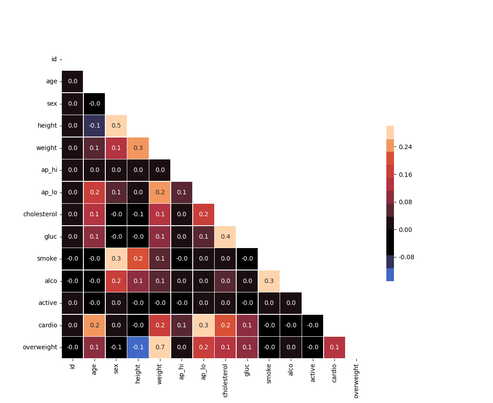

# Medical Data Visualizer

## Charts

  <h3>Bar Chart</h3>
  

 

  <h3>Heatmap</h3>
  

 

## Built with
- [pandas](https://github.com/pandas-dev/pandas) - Data analysis / manipulation library for Python
- [seaborn](https://github.com/seaborn/seaborn) - Statiscal data visualization using matplotlib
- [freeCodeCamp Medical Data Visualizer](https://github.com/freeCodeCamp/boilerplate-medical-data-visualizer) - Tasks, boilerplate
